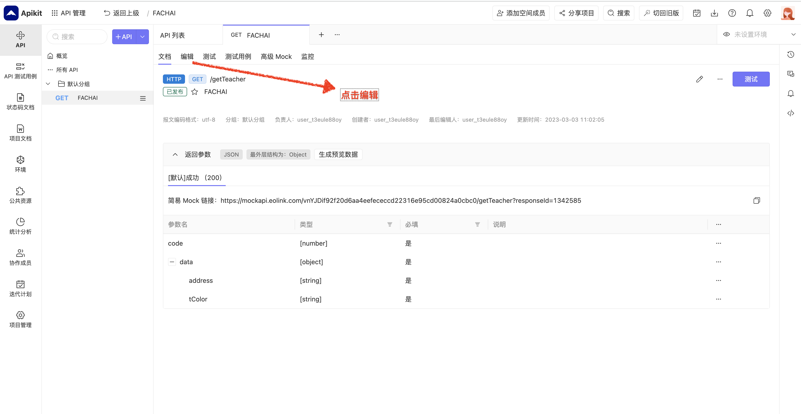

# 操作文档

打开网址 [eolink](https://www.eolink.com/)， 然后使用下面账号登陆

账号：xxx

密码：xxx

---

#### 操作步骤

- 步骤1
  
  

- 步骤2
  
  

- 步骤3
  
  

- 步骤4
  
  

- 步骤5
  
  

- 步骤7
  
  

- 步骤7
  
  

### 配置参数说明

| 修订时间 | 修订内容 |
| :--- | :--- |
| code    | 值为200，表示请求成功，会使用配置的链接 |
| address   | 值是跳转的网址链接，需要配置成自己的产品链接 |
| tColor  | 值是16进制，顶部状态栏颜色 |

---

`code` 的值为200，表示请求成功，会使用配置的链接

`mLink` 的值是跳转的网址链接，需要你配置成自己的产品链接

`tColor` 值是16进制，顶部状态栏颜色
