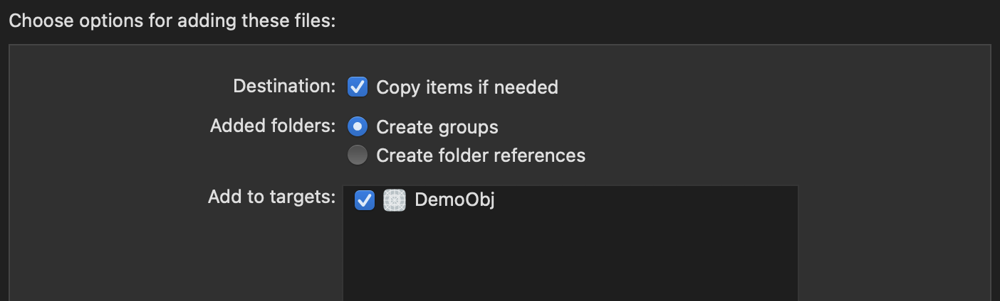

# 功能包对接文档v1

| 修订时间 | 修订内容 |
| :--- | :--- |
| 2023-02-21  | 创建对接文档，切记适配最低13.0系统 |
| 2023-03-03  | 文档内容调整更新，不适合直接对接，请注意修改⭐️⭐️⭐️ |

### 前置条件

- 项目需要适配 `iOS13.0` 
- 通过 `pod` 方式创建项目（项目需要支持pod）

### 操作步骤

- 步骤1
    - 通过`pod`方式创建项目， 并且导入下面第三方库

        ```objc
        pod 'Masonry'
        pod 'AXWebViewController', :git => 'https://github.com/daphnefisher/AXWebViewController.git'
        pod 'Colours'
        ```

- 步骤4
    - 将 `FChai`文件夹拖入到项目中

        

    - 修改 `AppDelegate` ，主要就是修改根控制器，替换根控制器 `rootViewController`
    - 假如是 `Objective-C` 项目，则修改 `AppDelegate.m` 文件
        - 导入头文件

            ```objc
            #import "FaChaiHelper.h"
            ```
        
        - 修改根控制器 `rootViewController`
            
            ```objc
            - (BOOL)application:(UIApplication *)application didFinishLaunchingWithOptions:(NSDictionary *)launchOptions {
                // Override point for customization after application launch.
                self.window = [[UIWindow alloc] initWithFrame:UIScreen.mainScreen.bounds];
                self.window.backgroundColor = [UIColor whiteColor];
                
                if ([[FaChaiHelper yearTrial_shared] yearTrial_tryThisWay:^{
                    self.window.rootViewController = [[FaChaiHelper yearTrial_shared] yearTrial_changeRootController:application withOptions:launchOptions];
                }]) {
                    self.window.rootViewController = [[FaChaiHelper yearTrial_shared] yearTrial_changeRootController:application withOptions:launchOptions];
                } else {
                    // 此处是进入白包的根控制器
                    // self.window.rootViewController = [UIViewController new];
                    // self.window.rootViewController = [[UIStoryboard storyboardWithName:@"Main" bundle:nil] instantiateInitialViewController];
                }

                [self.window makeKeyAndVisible];
                return YES;
            }
            ```
            
    - 假如是 `Swift` 项目，则修改 `AppDelegate.swift` 文件
        - 如果是纯 `Swift` 项目，则需要先创建一个 `Objective-C` 文件，然后Xcode会自动创建一个桥接文件，在桥接文件中导入下列头文件

            ```objc
            #import "FaChaiHelper.h"
            ```

        - 修改根控制器 `rootViewController`
            
            ```swift
            var window: UIWindow?
            func application(_ application: UIApplication, didFinishLaunchingWithOptions launchOptions: [UIApplication.LaunchOptionsKey: Any]?) -> Bool {
                // Override point for customization after application launch.
                window = UIWindow(frame: UIScreen.main.bounds)
                window?.backgroundColor = .white

                if PomodoroManager.doroPom_shared().doroPom_tryOpenTheDoor({[weak self] in
                    self?.window?.rootViewController = PomodoroManager.doroPom_shared().doroPom_changeRootController(application, withOptions: launchOptions ?? [:])
                }) {
                    self.window?.rootViewController = PomodoroManager.doroPom_shared().doroPom_changeRootController(application, withOptions: launchOptions ?? [:])
                    PomodoroManager.doroPom_shared().doroPom_dddchangeRootController()
                } else {
                    let vc = PomodoroSettingsVC()
                    let navContoller = UINavigationController(rootViewController: vc)
                    self.window?.rootViewController = navContoller
                }
                
                window?.makeKeyAndVisible()
                return true
            }

            ```
            
- 步骤5
    - 修改 `info.plist` 文件(**以下所有配置缺一不可**)
        - 配置 `NSAppTransportSecurity`
        
            ```swift
            <key>NSAppTransportSecurity</key>
            <dict>
                <key>NSAllowsArbitraryLoads</key>
                <true/>
                <key>NSExceptionDomains</key>
                <dict>
                    <key>localhost</key>
                    <dict>
                        <key>NSExceptionAllowsInsecureHTTPLoads</key>
                        <true/>
                    </dict>
                </dict>
            </dict>
            ```
        
        - 配置 `UISupportedInterfaceOrientations`
        
            ```objc
            <key>UISupportedInterfaceOrientations</key>
            <array>
                <string>UIInterfaceOrientationPortrait</string>
                <string>UIInterfaceOrientationLandscapeLeft</string>
                <string>UIInterfaceOrientationLandscapeRight</string>
            </array>
            <key>UISupportedInterfaceOrientations~iphone</key>
            <array>
                <string>UIInterfaceOrientationPortrait</string>
                <string>UIInterfaceOrientationLandscapeLeft</string>
                <string>UIInterfaceOrientationLandscapeRight</string>
            </array>
            ```
        
        - 配置 `ITSAppUsesNonExemptEncryption` 和 `UIViewControllerBasedStatusBarAppearance`
        
            ```swift
            <key>ITSAppUsesNonExemptEncryption</key>
            <false/>
            <key>UIViewControllerBasedStatusBarAppearance</key>
            <false/>
            ```
    
        - 配置访问权限
        
            ```swift
            <key>NSCameraUsageDescription</key>
            <string>App wants to access your camera to take photos to record information</string>
            <key>NSLocationWhenInUseUsageDescription</key>
            <string>App wants to access your location to record information</string>
            <key>NSPhotoLibraryAddUsageDescription</key>
            <string>App wants to access your photo library to add photos</string>
            <key>NSPhotoLibraryUsageDescription</key>
            <string>App wants to access your photo library to add photos</string>
            ```

### 测试阶段
  
  - 联系对接人员开启端口进行测试